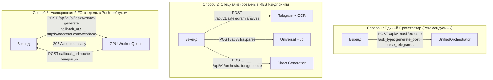

# 📘 UCust AI Service Gateway — Руководство по интеграции для Бэкенда (v2.5.0)

Полная техническая спецификация подключения основного бэкенда (Java Spring / Node.js / Go / Python) к микросервису **UCust AI Gateway**.

---

## 1. Метод запуска и развертывания AI-сервиса на сервере

На выделенном GPU-сервере (Linux / NVIDIA A100 `vm8720`) запуск выполняется следующими командами:

### Вариант А: Интерактивный запуск (в виртуальном окружении)
```bash
# 1. Переход в рабочую директорию AI-контура
cd /opt/ucust/ai

# 2. Активация виртуального окружения
source venv/bin/activate

# 3. Синхронизация последней версии кода из Git
git pull origin feature-ai

# 4. Запуск шлюза FastAPI и фоновых воркеров очереди
python start.py
```

### Вариант Б: Фоновый запуск скрипта в фоне с записью логов
```bash
cd /opt/ucust
nohup bash start_ai_service.sh > ai_service.log 2>&1 &
```

### Проверка статуса сервиса и просмотр логов в реальном времени
```bash
# Проверка доступности API и моделей
curl http://localhost:8000/health

# Просмотр логов в реальном времени
tail -n 50 -f /opt/ucust/ai_service.log
```

---

## 2. Базовые параметры подключения к AI-контуру

| Параметр | Значение | Описание |
| :--- | :--- | :--- |
| **Базовый URL (Production)** | `http://<AI_HOST>:8000` | Хост AI-сервиса (FastAPI / WireGuard) |
| **Интерактивный Swagger UI** | `http://<AI_HOST>:8000/docs` | Документация и тестирование запросов через веб-интерфейс |
| **Схема OpenAPI (JSON)** | `http://<AI_HOST>:8000/openapi.json` | Спецификация для кодогенерации DTO (Java, TypeScript, Go) |
| **Header безопасности** | `X-Internal-Secret: ucust-super-secret-service-token-2026` | Обязательный секрет сервисной авторизации |
| **Раздача медиа** | `http://<AI_HOST>:8000/output/photos/...` | Статический доступ к сгенерированным фото и баннерам |

---

## 3. Три метода взаимодействия Бэкенда с AI



### 3.1. Концепция Single Entry Point (Единый эндпоинт для 100% задач)

> [!IMPORTANT]
> **Ключевой принцип для бэкендера:** Бэкенду **достаточно реализовать ровно 1 HTTP-клиент (DTO-модель)** для вызова эндпоинта `POST /api/v1/task/execute` и просто передавать нужный `task_type`.
> 
> Все остальные 36 эндпоинтов в Swagger являются удобными REST-фасадами (алиасами). Под капотом **абсолютно все запросы маршрутизируются в `UnifiedOrchestrator`**, который централизованно контролирует безопасность (SecurityGuard), логирует трейсы в PostgreSQL, обращается к Redis-кэшу, задействует GPU-модели (Saiga NeMo 12B, Moondream2, PaddleOCR, ComfyUI) и автоматически отправляет Webhook на бэкенд.

---

## 4. Полный реестр эндпоинтов AI-контура

| Группа / Метод | Основной URL и Алиасы | Назначение и Особенности |
| :--- | :--- | :--- |
| **Orchestrator**<br>`POST` | `/api/v1/task/execute`<br>`/api/v1/orchestrator/execute` | **Единый шлюз оркестратора**. Принимает любую задачу по `task_type` с авто-пушем в бэкенд. |
| **Direct Gen**<br>`POST` | `/orchestration/generate`<br>`/api/v1/orchestration/generate` | Прямая генерация поста с полным обогащением из `ProjectContext` (брендбук, цвета, TOV). |
| **Universal Hub**<br>`POST` | `/api/v1/ai/parse`<br>`/api/v1/collectors/parse` | **Умный парсер**: автоопределение ресурса по ссылке (TG, VK, Site, 2GIS, Docs). |
| **Telegram**<br>`POST` | `/api/v1/ai/telegram/analyze`<br>`/api/v1/collectors/telegram` | Парсинг Telegram-канала + **Moondream2 & PaddleOCR** (GPU) для фото постов. |
| **VK**<br>`POST` | `/api/v1/ai/vk/analyze`<br>`/api/v1/collectors/vk` | Сбор постов, реакций, охватов и частых вопросов из сообществ ВКонтакте. |
| **Geo Maps**<br>`POST` | `/api/v1/ai/geo/analyze`<br>`/api/v1/collectors/geo` | Сбор отзывов, рейтингов и клиентского опыта из **2GIS** и **Яндекс Карт**. |
| **Website**<br>`POST` | `/api/v1/ai/website/analyze`<br>`/api/v1/collectors/website` | Глубокий парсинг сайта, УТП, структуры услуг и извлечение палитры бренда. |
| **Competitor**<br>`POST` | `/api/v1/ai/competitor/analyze` | Анализ сайта конкурента, матрица SWOT, UVP и контр-стратегия отстройки. |
| **Documents**<br>`POST` | `/api/v1/ai/documents/analyze`<br>`/api/v1/collectors/analyze-documents` | Извлечение текста, таблиц и прайсов из PDF, DOCX, PPTX. |
| **Brand Onboard**<br>`POST` | `/api/v1/collectors/analyze-brand` | Комплексный онбординг бренда (комбинация сайт + соцсети + документы + фото). |
| **Quick Vision**<br>`POST` | `/api/v1/vision/quick-analyze` | Экспресс-анализ 1–3 фото пользователя (цвета, объекты, стиль, OCR). |
| **Image Gen**<br>`POST` | `/api/v1/ai/generate-image` | Генерация маркетинговой графики (ComfyUI / SDXL / FLUX). |
| **Async Queue**<br>`POST` | `/api/v1/ai/tasks/async-generate` | Постановка задачи в FIFO GPU-очередь с Push Webhook коллбеком. |
| **Queue Status**<br>`GET` | `/api/v1/ai/tasks/{task_id}/status` | Опрос статуса задачи (`QUEUED`, `PROCESSING`, `COMPLETED`, `FAILED`). |
| **RAG Query**<br>`POST` | `/api/v1/ai/rag/query` | Семантический поиск по базе знаний Clean RAG с защитой от галлюцинаций. |
| **RAG Ingest**<br>`POST` | `/api/v1/ai/rag/ingest` | Индексация документов и фрагментов знаний в векторное хранилище. |
| **Strategy**<br>`POST` | `/api/v1/ai/strategy/generate` | Генерация контент-стратегии (воронка TOFU/MOFU/BOFU, JTBD, хуки). |
| **Critic**<br>`POST` | `/api/v1/ai/critic/review` | Инверсионный Pre-Mortem аудит текста (Чарли Мангер) и устранение клише. |
| **Health**<br>`GET` | `/api/v1/ai/health`<br>`/health`<br>`/` | Проверка статуса AI-шлюза и доступности моделей. |
| **Trends**<br>`GET` | `/api/v1/ai/trends` | Отдача закешированных недельных трендов ниши (3-5 мс). |
| **Tariffs**<br>`GET` | `/api/v1/ai/tariffs`<br>`/api/v1/tariffs` | **Матрица тарифов**: лимиты генераций, дни недели и поддерживаемые фичи. |
| **Quota**<br>`GET` | `/api/v1/ai/clients/{id}/subscription-quota`<br>`/api/v1/subscription/quota` | Проверка квоты клиента и расчет 30-дневного календарного расписания. |
| **WebSocket**<br>`WS` | `/ws/ai/session/{session_id}` | Real-time стриминг событий онбординга и генерации для фронтенда. |

---

## 5. Тарифные планы, квотирование и матрица возможностей (Capabilities Matrix)

AI-контур поддерживает динамическое квотирование и адаптацию контента под тариф подписки клиента. Параметр `tier` может передаваться в запросе (`"tier": "BUSINESS"` или внутри `projectContext`):

### 5.1. Сравнительная матрица тарифов платформы

| Возможность / Параметр | `START` (Старт) | `BUSINESS` (Бизнес — Рекомендуемый) | `ENTERPRISE` (Корпоративный) | `CUSTOM` (Индивидуальный) |
| :--- | :--- | :--- | :--- | :--- |
| **Лимит постов в месяц** | **12 постов** | **20 постов** | **30 постов (ежедневно)** | **50+ постов** |
| **Частота в неделю** | 3 раза в неделю | 5 раз в неделю (Пн–Пт) | 7 дней в неделю | 7 дней в неделю |
| **Разрешенные дни** | Пн, Ср, Пт (`[0, 2, 4]`) | Пн, Вт, Ср, Чт, Пт (`[0..4]`) | Пн–Вс (`[0..6]`) | Пн–Вс (`[0..6]`) |
| **Студийные фото (ComfyUI)** | ✅ Да (1:1) | ✅ Да (1:1, 9:16, 16:9) | ✅ Да (1:1, 9:16, 16:9, 4:5) | ✅ Да (любые) |
| **VLM & OCR (Moondream2)** | ❌ Нет | ✅ Да (анализ фото и чеков) | ✅ Да (глубокий анализ) | ✅ Да |
| **База знаний Clean RAG** | ❌ Нет | ✅ Да (семантический поиск) | ✅ Да (персональная БД) | ✅ Да |
| **Критик Чарли Мангера** | Базовый (строгость 0.80) | Стандартный (строгость 0.90) | Максимальный (строгость 0.95) | Настраиваемый |
| **Ракурсы воронки (Хант)** | 1 ракурс | 4 ракурса (`multi_variations`) | 8 ракурсов | 10+ ракурсов |
| **Каналы публикации** | Telegram | Telegram, VK, Веб-сайт | Telegram, VK, Instagram, OK, MAX | Все каналы |
| **Видеогенерация LTX-2.3** | ❌ Нет | ❌ Нет (фокус на фото) | ✅ Да (видео со звуком) | ✅ Да |
| **Приоритет в очереди** | `STANDARD` | `HIGH` | `DEDICATED_REALTIME` | `DEDICATED_REALTIME` |

### 5.2. Пример ответа эндпоинта проверки квоты (`GET /api/v1/ai/clients/{client_id}/subscription-quota?tier=BUSINESS`):

```json
{
  "status": "success",
  "client_id": "client_dentallux_101",
  "subscription_status": "ACTIVE",
  "monthly_post_limit": 20,
  "remaining_quota": 20,
  "tier": {
    "tier_name": "BUSINESS",
    "title": "Бизнес Стандарт (Оптимальный для большинства ниш)",
    "monthly_post_limit": 20,
    "posts_per_week": 5,
    "allowed_days_of_week": [0, 1, 2, 3, 4],
    "allowed_weekdays_ru": ["Понедельник", "Вторник", "Среда", "Четверг", "Пятница"],
    "media_capabilities": {
      "studio_photo_comfyui": true,
      "aspect_ratios": ["1:1", "9:16", "16:9"],
      "vlm_moondream_ocr": true,
      "video_generation_ltx23": false,
      "clean_rag_knowledge_base": true,
      "charlie_munger_critic_strictness": 0.90,
      "multi_variations_count": 4,
      "supported_channels": ["telegram", "vk", "website"]
    },
    "queue_priority": "HIGH"
  },
  "calendar_slots_count": 20,
  "calendar_slots": [
    { "slot_index": 1, "date": "2026-09-01", "time": "10:00", "weekday": "Tuesday", "post_type": "PHOTO_AND_TEXT" },
    { "slot_index": 2, "date": "2026-09-02", "time": "14:30", "weekday": "Wednesday", "post_type": "PHOTO_AND_TEXT" },
    { "slot_index": 3, "date": "2026-09-03", "time": "10:00", "weekday": "Thursday", "post_type": "PHOTO_AND_TEXT" },
    { "slot_index": 4, "date": "2026-09-04", "time": "14:30", "weekday": "Friday", "post_type": "PHOTO_AND_TEXT" },
    { "slot_index": 5, "date": "2026-09-07", "time": "10:00", "weekday": "Monday", "post_type": "ENGAGING_TEXT" }
  ]
}
```

---

## 6. Полный спектр команд генерации контента

AI-контур поддерживает 8 специализированных команд генерации под любые маркетинговые задачи:

| Команда / Task Type | Управляющие параметры | Формат и Результат |
| :--- | :--- | :--- |
| **`generate_post`**<br>*(Пост под ключ)* | `topic`, `rubric` (`EXPERT`, `PRODUCT`, `PROMO`, `CASE`, `LIFE`, `MEME`), `primaryCta` (`BUY`, `BOOK`, `COMMENT`, `CHAT`, `PROMO`), `promo_code`, `aspect_ratio`, `projectContext` | Полный пост с хуком, структурой (PAS/AIDA/StoryBrand), CTA-кнопкой, скором критика и готовым изображением ComfyUI. |
| **`generate_image`**<br>*(Только графика)* | `prompt`, `niche`, `aspect_ratio` (`1:1`, `9:16`, `16:9`, `4:5`), `style` (`photorealistic`, `warm_natural`, `minimalist`) | Генерация изображения по визуальному брифу на ComfyUI / FLUX. Возвращает `image_url` и seed. |
| **`plan_content`**<br>*(Контент-план)* | `company_name`, `niche`, `days_count` (7 или 30), `posts_per_week`, `goals` | Сбалансированная календарная матрица постов с датами, рубриками, готовыми темами, форматами и целями. |
| **`prepare_holiday_greeting`**<br>*(Праздники)* | `company_name`, `niche`, `holiday_name` (`auto` или конкретная дата), `promo_offer` | Поздравление с профессиональным или календарным праздником, органично увязанное с продуктом бизнеса. |
| **`generate_strategy`**<br>*(Маркетинг-воронка)* | `company_name`, `niche`, `target_audience`, `usp` | Декомпозиция воронки (TOFU — охват, MOFU — прогрев, BOFU — продажа), база виральных хуков и аватар клиента (JTBD). |
| **`critic_review`**<br>*(Аудит Чарли Мангера)* | `text`, `topic`, `niche`, `strictness` (`0.5` - `0.95`) | Pre-Mortem аудит текста: выявление клише, воды, слабых хуков + выдача готовой улучшенной версии. |
| **`multi_variations`**<br>*(Ракурсы и воронка)* | `stage` (`unaware`, `problem_aware`, `solution_aware`), `framework` (`PAS`, `AIDA`, `StoryBrand`), `trigger` (`scarcity`, `social_proof`), `variation_index` (`0..3`) | Генерация различных ракурсов и психологических триггеров одного оффера для A/B тестирования. |
| **`trends_post`**<br>*(Вирусные мемы 2026)* | `niche`, `company_name`, `meme_id` (из базы трендов 2024–2026) | Адаптация свежего тренда под нишу бизнеса с автоматическим Anti-Cringe фильтром. |

---

## 6. Готовые примеры интеграционных запросов (cURL + JSON)

### Пример А: Сквозная генерация поста с `ProjectContext` (`POST /orchestration/generate`)

```json
POST http://<AI_HOST>:8000/orchestration/generate
Headers:
  Content-Type: application/json
  X-Internal-Secret: ucust-super-secret-service-token-2026

{
  "prompt": "Анонс тыквенного рафа и скидка 20% по промокоду",
  "promoCode": "PUMPKIN20",
  "rubric": "PRODUCT",
  "primaryCta": "BUY",
  "generate_image": true,
  "aspect_ratio": "1:1",
  "projectContext": {
    "company_name": "Specialty Coffee Roasters",
    "niche": "Кофейня и обжарка зерна",
    "city": "Москва",
    "toneOfVoice": "FRIENDLY",
    "brandGuidelines": {
      "addressingStyle": "YOU_PLURAL",
      "forbiddenWords": ["дешево", "шок-цена"],
      "emojiPolicy": "MINIMAL"
    },
    "visualDna": {
      "brandColors": ["#4A2E18", "#E8D8C8"],
      "visualStyle": "WARM_NATURAL"
    }
  }
}
```

### Пример Б: Универсальный парсинг ссылки при онбординге (`POST /api/v1/ai/parse`)

```json
POST http://<AI_HOST>:8000/api/v1/ai/parse
Headers:
  Content-Type: application/json
  X-Internal-Secret: ucust-super-secret-service-token-2026

{
  "source_type": "auto",
  "target": "https://t.me/loft_coffee_spb",
  "limit": 5,
  "include_media_vqa": true,
  "user_id": "usr_991"
}
```

### Пример В: Асинхронная постановка в GPU-очередь с Webhook (`POST /api/v1/ai/tasks/async-generate`)

```json
POST http://<AI_HOST>:8000/api/v1/ai/tasks/async-generate
Headers:
  Content-Type: application/json

{
  "topic": "Тренды автоматизации маркетинга 2026",
  "company_name": "UCust",
  "aspect_ratio": "9:16",
  "callback_url": "https://api.ucust.ai/api/v1/ai/webhook-receiver",
  "user_id": "usr_772"
}
```

---

## 7. Спецификация обратного вебхука (Reverse Webhook Push)

Когда бэкенд вызывает генерацию через `POST /api/v1/tasks/async-generate` или `POST /api/v1/task/execute` с параметром `callback_url`, AI-сервис после завершения генерации **сам выполняет HTTP POST запрос на бэкенд**.

### Формат входящего Webhook-запроса от AI на Бэкенд:

```http
POST https://backend.ucust.ai/api/v1/ai/webhook-receiver
Content-Type: application/json
X-Internal-Secret: ucust-super-secret-service-token-2026
```

```json
{
  "task_id": "task_bc9204fa",
  "user_id": "usr_772",
  "session_id": "sess_84df10a",
  "task_type": "generate_post",
  "status": "COMPLETED",
  "timestamp": 1789035600,
  "result": {
    "status": "success",
    "post_text": "Невесомая, как облако, и яркая, как весеннее утро 🌸\n\nВстречайте нашу обновленную «Павлову» с маскарпоне и свежей малиной.\n\n🎁 Скидка 15% по промокоду SWEET15 до конца недели!",
    "image_url": "http://<AI_HOST>:8000/output/photos/gen_pavlova_991.png",
    "photo_url": "http://<AI_HOST>:8000/output/photos/gen_pavlova_991.png",
    "hashtags": "#десерты #кондитерская #павлова #спешелти",
    "critic_score": 9.6,
    "metadata": {
      "framework": "PAS",
      "rubric": "PRODUCT",
      "primary_cta": "BUY",
      "tone": "FRIENDLY",
      "language": "ru",
      "estimated_reach": 2400
    },
    "timings": {
      "vision_seconds": 0.25,
      "llm_seconds": 2.1,
      "image_gen_seconds": 5.4,
      "total_seconds": 7.75
    }
  }
}
```

### Таблица полей обратного вебхука:

| Параметр / Поле | Тип данных | Назначение в Бэкенде |
| :--- | :--- | :--- |
| **`task_id`** | `String` | ID задачи, возвращенный при постановке в очередь (для сопоставления в БД). |
| **`status`** | `String` | `COMPLETED` или `FAILED` — флаг успешности генерации на GPU. |
| **`result.post_text`** | `String (UTF-8)` | Готовый финальный текст публикации с абзацами, эмодзи и хуком. |
| **`result.image_url`** | `String (URL)` | Прямая ссылка для скачивания или раздачи сгенерированного фото/баннера. |
| **`result.critic_score`** | `Float (0..10)` | Оценка качества и конверсии текста от ИИ-критика Чарли Мангера. |
| **`result.metadata`** | `JSON Object` | Маркетинговые метаданные (рубрика, фреймворк, воронка, CTA). |
| **`result.timings`** | `JSON Object` | Сводка времени выполнения (LLM, Vision, генерация графики). |
| **Отказоустойчивость** | `Retry: 3, 10, 30s` | При недоступности бэкенда AI автоматически повторяет отправку 3 раза. |
