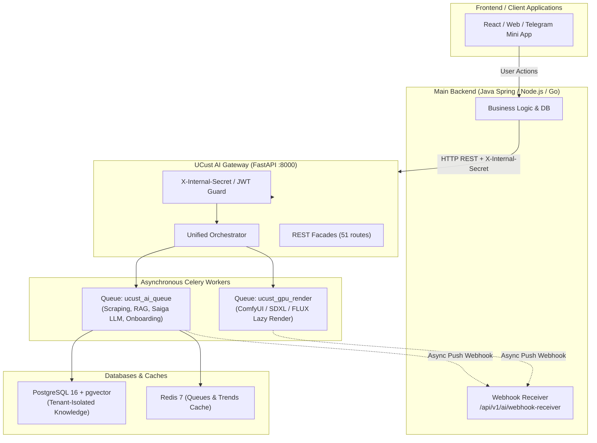
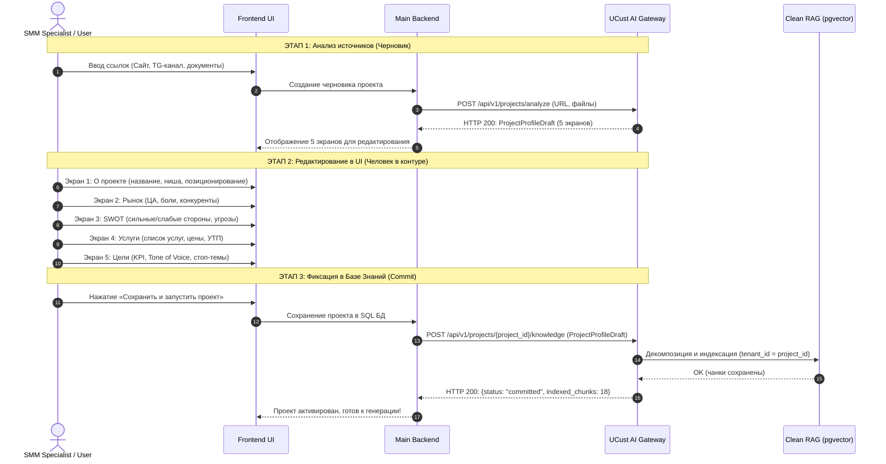
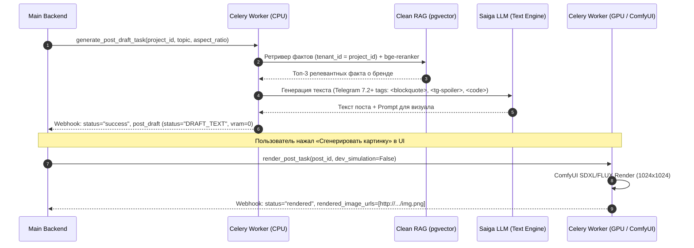

# 📘 UCust AI Service Gateway — Руководство по интеграции для Бэкенда (v2.6.0)

Полная техническая спецификация подключения основного бэкенда (Java Spring / Node.js / Go / Python) к микросервису **UCust AI Gateway**.

---

## 1. Архитектурный обзор и варианты подключения

Микросервис **UCust AI** предоставляет единую платформу для анализа брендов, извлечения Brand DNA, многоуровневого векторного поиска (Clean RAG на pgvector), генерации контента для социальных сетей (Telegram 7.2+, VK) и отложенного рендеринга визуалов на ComfyUI (SDXL / FLUX).



---

## 2. Базовые параметры подключения и безопасность

| Параметр | Значение | Описание |
| :--- | :--- | :--- |
| **Базовый URL (Production)** | `http://<AI_HOST>:8000` | Хост AI-сервиса (FastAPI) |
| **Интерактивный Swagger UI** | `http://<AI_HOST>:8000/docs` | Документация и тестирование запросов через веб-интерфейс |
| **Схема OpenAPI 3.1 (JSON)** | `http://<AI_HOST>:8000/openapi.json` | Спецификация для кодогенерации DTO (Java, TypeScript, Go) |
| **Header безопасности** | `X-Internal-Secret: ucust-super-secret-service-token-2026` | Обязательный заголовок сервисной авторизации |
| **Метрики Prometheus** | `http://<AI_HOST>:8000/metrics` | Экспорт метрик производительности и очередей (OpenMetrics) |
| **Раздача медиа** | `http://<AI_HOST>:8000/output/photos/...` | Статический доступ к сгенерированным фото и баннерам |

---

## 3. Сценарии интеграции

### Сценарий 1: Human-in-the-Loop (HITL) Онбординг проекта (5 Экранов)

Процесс регистрации проекта в системе разделен на два изолированных этапа, что позволяет SMM-специалисту проверять и корректировать сгенерированный ИИ профиль до его записи в постоянную память.



#### Структура данных 5 экранов онбординга (`ProjectProfileDraft`):

```json
{
  "about": {
    "name": "Кофейня Аромат Зерен",
    "niche": "Спешелти кофейня и пекарня",
    "positioning": "Свежеобжаренное зерно категории Specialty и ремесленные круассаны",
    "website_url": "https://coffee-beans-example.ru",
    "telegram_channel": "https://t.me/coffee_beans_example"
  },
  "market": {
    "target_audience": "Жители и сотрудники бизнес-центров 22-45 лет, ценящие качественный кофе",
    "audience_segments": ["Офисные сотрудники (takeaway)", "Фрилансеры (работа в зале)", "Ценители specialty"],
    "key_pain_points": ["Горький кофе из автоматов", "Медленное обслуживание в утренний час пик"],
    "competitors": ["Surf Coffee", "Даблби", "Stars Coffee"]
  },
  "swot": {
    "strengths": ["Собственная обжарка", "Удобное расположение", "Свежая выпечка каждые 2 часа"],
    "weaknesses": ["Небольшой зал (25 мест)", "Отсутствие полноценной кухни горячих блюд"],
    "opportunities": ["Запуск подписки на зерно домой", "B2B поставки в соседние офисы"],
    "threats": ["Рост цен на зеленое зерно", "Открытие федеральной сети рядом"]
  },
  "services": [
    {
      "name": "Авторский напиток: Хвойный латте",
      "description": "Эспрессо на зерне Эфиопия с добавлением натурального сиропа из молодых шишек и брусники",
      "price_range": "380 ₽ (350 мл)",
      "usp": "100% натуральные сиропы собственного приготовления без красителей"
    }
  ],
  "goals": {
    "content_goals": ["Рост узнаваемости в районе", "Увеличение продаж десертов", "Анонсы сезонного меню"],
    "tone_of_voice": ["Теплый", "Гостеприимный", "Экспертный", "Лаконичный"],
    "forbidden_topics": ["Политика", "Сравнение в лоб с конкурентами", "Скидочный агрессивный маркетинг"]
  }
}
```

---

### Сценарий 2: Core Value Loop генерации контента (Telegram 7.2+ & Lazy Rendering)

Генерация контента построена на архитектуре **двухфазного рендеринга (Lazy Rendering)** для минимизации GPU-расходов:
1. **Фаза 1 (Текст + Визуальный бриф):** Выполняется за 0.5–1.5 сек на CPU/Saiga LLM. Стоимость GPU = **0 VRAM**. Возвращается `PostDraft` со статусом `DRAFT_TEXT` и собранной спецификацией `ImageGenerationSpec`.
2. **Фаза 2 (Рендер изображения):** Запускается только после подтверждения пользователем в UI или по таймеру публикации через очередь `ucust_gpu_render`.



#### Правила разметки Telegram 7.2+:
- **Сворачиваемые цитаты:** `<blockquote expandable>текст деталей или цитаты</blockquote>`
- **Спойлеры:** `<tg-spoiler>скрытый текст скидки или ответа</tg-spoiler>`
- **Форматирование:** `<b>жирный</b>`, `<i>курсив</i>`, `<code>промокод</code>`
- **Zero-Assumptions:** ИИ строго использует только факты из Brand DNA и RAG-памяти проекта.
- **Эмодзи-гигиена:** Не более 2–3 смысловых акцентов на весь пост.

---

## 4. Реестр ключевых эндпоинтов

| Группа | Метод и URL | Назначение |
| :--- | :--- | :--- |
| **HITL Onboard** | `POST /api/v1/projects/analyze`<br>`POST /api/v1/parser/analyze` | **Фаза 1:** Сбор данных по ссылкам и генерация `ProjectProfileDraft` без записи в БД. |
| **HITL Commit** | `POST /api/v1/projects/{project_id}/knowledge`<br>`POST /api/v1/projects/commit` | **Фаза 2:** Фиксация подтвержденного профиля в RAG/pgvector с тенантом `project_id`. |
| **Orchestrator** | `POST /api/v1/task/execute`<br>`POST /api/v1/orchestrator/execute` | **Единый шлюз задач**. Маршрутизирует любую операцию по `task_type`. |
| **Direct Gen** | `POST /orchestration/generate`<br>`POST /api/v1/orchestration/generate` | Прямая синхронная генерация поста с контекстом бренда. |
| **Async Tasks** | `POST /api/v1/ai/tasks/async-generate` | Асинхронная постановка задачи в очередь Celery с Push-вебхуком. |
| **Task Status** | `GET /api/v1/ai/tasks/{task_id}/status` | Проверка статуса выполнения фоновой задачи. |
| **Render Post** | `POST /api/v1/ai/tasks/render/{post_id}` | Запуск отложенного GPU-рендеринга для сгенерированного черновика. |
| **RAG Query** | `POST /api/v1/ai/rag/query` | Семантический поиск по базе знаний с защитой от галлюцинаций. |
| **Observability** | `GET /metrics` | Экспорт Prometheus метрик (латентность, очереди, VRAM). |
| **Health** | `GET /health` или `GET /api/v1/ai/health` | Проверка жизнеспособности сервиса и загруженных моделей. |

---

## 5. Готовые примеры интеграционных запросов

### Пример 1: Анализ источников для онбординга (`POST /api/v1/projects/analyze`)

```http
POST http://<AI_HOST>:8000/api/v1/projects/analyze
Content-Type: application/json
X-Internal-Secret: ucust-super-secret-service-token-2026
```

```json
{
  "company_name": "Specialty Coffee Roasters",
  "niche": "Спешелти кофейня и обжарка",
  "website_url": "https://coffee-example.ru",
  "telegram_channel": "https://t.me/coffee_roasters_spb",
  "raw_notes": "Специализируемся на светлой обжарке Эфиопии и Колумбии. Скидка 15% на первый заказ зерна."
}
```

**Ответ (HTTP 200):**
```json
{
  "status": "success",
  "profile_draft": {
    "about": {
      "name": "Specialty Coffee Roasters",
      "niche": "Спешелти кофейня и обжарка",
      "positioning": "Светлая обжарка кофе категории Specialty",
      "website_url": "https://coffee-example.ru",
      "telegram_channel": "https://t.me/coffee_roasters_spb"
    },
    "market": {
      "target_audience": "Ценители яркого спешелти кофе и фильтр-заваривания",
      "audience_segments": ["Домашние брюверы", "Гости кофейни"],
      "key_pain_points": ["Темная пережаренная коммерческая арабика"],
      "competitors": ["Восход Кофе", "Торрефакто"]
    },
    "swot": {
      "strengths": ["Прямой импорт микролотов", "Свежая обжарка"],
      "weaknesses": ["Узкая ниша"],
      "opportunities": ["B2B поставки в офисы"],
      "threats": ["Колебания курса валют на зеленое зерно"]
    },
    "services": [
      {
        "name": "Зерно Эфиопия Иргачефф 250г",
        "description": "Ноты бергамота, жасмина и спелого персика",
        "price_range": "850 ₽",
        "usp": "Обжарка под фильтр за 48 часов до отправки"
      }
    ],
    "goals": {
      "content_goals": ["Рост продаж зерна онлайн"],
      "tone_of_voice": ["Экспертный", "Дружелюбный"],
      "forbidden_topics": ["Политика", "Сравнения в лоб"]
    }
  }
}
```

---

### Пример 2: Фиксация профиля в Базе Знаний (`POST /api/v1/projects/project_101/knowledge`)

```http
POST http://<AI_HOST>:8000/api/v1/projects/project_101/knowledge
Content-Type: application/json
X-Internal-Secret: ucust-super-secret-service-token-2026
```

```json
{
  "project_id": "project_101",
  "profile": {
    "about": {
      "name": "Specialty Coffee Roasters",
      "niche": "Спешелти кофейня и обжарка",
      "positioning": "Светлая обжарка кофе категории Specialty"
    },
    "market": {
      "target_audience": "Ценители яркого спешелти кофе",
      "audience_segments": ["Домашние брюверы"],
      "key_pain_points": ["Темная пережаренная арабика"],
      "competitors": ["Восход Кофе"]
    },
    "swot": {
      "strengths": ["Прямой импорт микролотов"],
      "weaknesses": ["Узкая ниша"],
      "opportunities": ["B2B поставки в офисы"],
      "threats": ["Рост курса валют"]
    },
    "services": [
      {
        "name": "Зерно Эфиопия Иргачефф 250г",
        "description": "Ноты бергамота и персика",
        "price_range": "850 ₽",
        "usp": "Свежая обжарка"
      }
    ],
    "goals": {
      "content_goals": ["Рост продаж зерна онлайн"],
      "tone_of_voice": ["Экспертный", "Дружелюбный"],
      "forbidden_topics": ["Политика"]
    }
  }
}
```

**Ответ (HTTP 200):**
```json
{
  "status": "success",
  "project_id": "project_101",
  "message": "База знаний проекта 'project_101' успешно обновлена и проиндексирована в Clean RAG",
  "indexed_chunks": 5
}
```

---

### Пример 3: Постановка задачи генерации в Celery с Webhook (`POST /api/v1/task/execute`)

```http
POST http://<AI_HOST>:8000/api/v1/task/execute
Content-Type: application/json
X-Internal-Secret: ucust-super-secret-service-token-2026
```

```json
{
  "task_type": "generate_post",
  "project_id": "project_101",
  "prompt": "Рассказать о правильной температуре воды для заваривания светлой обжарки",
  "aspect_ratio": "1:1",
  "callback_url": "https://backend.ucust.ai/api/v1/ai/webhook-receiver"
}
```

**Ответ (HTTP 202 Accepted):**
```json
{
  "status": "accepted",
  "task_id": "celery-task-9481ad-491",
  "message": "Задача принята в фоновую обработку. Результат будет отправлен на callback_url"
}
```

---

## 6. Спецификация обратного вебхука (Push Webhook)

После завершения генерации текста или рендеринга визуала AI-сервис отправляет HTTP POST запрос на переданный `callback_url`.

### Формат входящего Webhook-запроса от AI:

```http
POST https://backend.ucust.ai/api/v1/ai/webhook-receiver
Content-Type: application/json
X-Internal-Secret: ucust-super-secret-service-token-2026
X-UCust-Signature: sha256=d3b07384d113edec49eaa6238ad5ff00...
```

```json
{
  "task_id": "celery-task-9481ad-491",
  "event_type": "content_draft_ready",
  "tenant_id": "project_101",
  "status": "success",
  "timestamp": 1789851600,
  "data": {
    "status": "success",
    "project_id": "project_101",
    "post_draft": {
      "post_id": "post_a9103de4",
      "brand_id": "project_101",
      "status": "draft_text",
      "text_content": "☕ <b>Секрет идеальной экстракции светлой обжарки</b>\n\nПочему вода 100°C может испортить чашку, а 92°C раскроет букет?\n\n<blockquote expandable>\nСветлая обжарка сохраняет органические кислоты и деликатные эфирные масла. При температуре 91-93°C вы получаете баланс цитрусовой сладости без излишней терпкости.\n</blockquote>\n\nПромокод на кофе недели: <code>LIGHT2026</code> (скидка 15%).",
      "image_specs": [
        {
          "prompt": "cinematic commercial shot, specialty coffee, brewing filter v60 kettle pour, soft morning sunlight, 8k",
          "aspect_ratio": "1:1",
          "width": 1024,
          "height": 1024
        }
      ],
      "rendered_image_urls": [],
      "vram_cost_mb": 0
    }
  }
}
```

---

## 7. Локальная разработка и Mock-сервер (Ветка `mock-ai`)

Для разработки и тестирования бэкенда без необходимости разворачивать GPU, тяжелые LLM и локальные веса моделей доступен легковесный **UCust AI Mock Server**:

### Запуск Mock-сервера:
```bash
# 1. Переключение на моковую ветку
git checkout mock-ai

# 2. Установка зависимостей (только FastAPI и Uvicorn)
pip install -r ai_mock/requirements.txt

# 3. Запуск сервера
python start_mock.py
```

- Mock-сервер поднимается на порту `8000` (`http://localhost:8000`).
- Полностью реализует все 51 контрактных эндпоинта (включая `/api/v1/projects/analyze`, `/api/v1/projects/{project_id}/knowledge`, `/api/v1/task/execute`, `/metrics`).
- Возвращает мгновенные валидные ответы, имитирует задержки очередей и отправляет тестовые Webhook-коллбэки на указанный `callback_url`.
