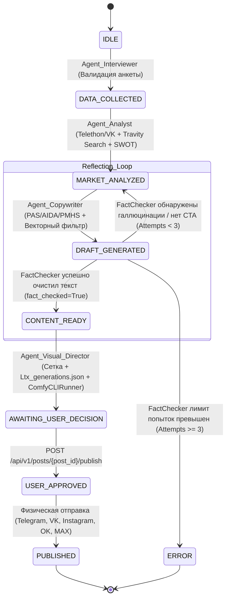
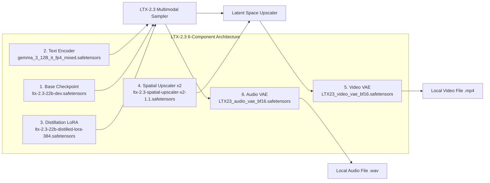
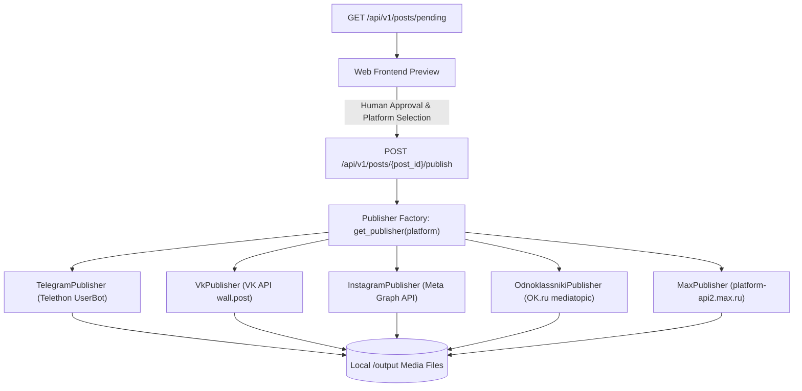

# Архитектурный отчет, спецификация и аудит подсистемы AI-агентов «UCust.AI»

**Дата обновления:** 29 июля 2026 г.  
**Версия системы:** 2.1.0-SingleServer-LTX2.3-MultiPlatform  
**Статус:** Выполнена полная миграция визуальной подсистемы на архитектуру LTX-2.3 (ComfyUI Headless API), внедрен веб-поиск Travity API, асинхронный FSM-оркестратор с хуками памяти VRAM, подсистема мультиплатформенной публикации (Telegram Telethon UserBot, VK API, Instagram Meta Graph API, OK.ru API, MAX Messenger) и единая архитектура Single-Server Deployment.

---

## 1. Обзор системы и Single-Server Deployment

**UCust.AI** — автономная мультиагентная платформа автоматизации полного производственного цикла SMM-контента (маркетинговый анализ, веб-поиск через Travity API, генерация постов по структурам PAS/AIDA/PMHS, контроль уникальности, верификация фактчекером, планирование мультимодального видео+аудио контента LTX-2.3, ручное подтверждение Human-in-the-Loop и публикация в соцсетях).

### Архитектура Single-Server Deployment
Продакшен-ядро системы (FastAPI, конвейер агентов `AgentOrchestrator`, PostgreSQL) и генеративная мультимодальная подсистема (ComfyUI Headless API) развернуты на **ОДНОМ сервере (единая инфраструктура)**.

1. **Локальное сетевое взаимодействие:** API-запросы от агентов к генеративному движку передаются по локальному шлейфу на `http://127.0.0.1:8188/prompt` без выхода во внешнюю сеть.
2. **Прямой доступ к медиафайлам на диске:** Готовые сгенерированные видеоклипы (.mp4) и аудиодорожки (.wav) считываются напрямую из локальной директории `output/` ComfyUI (`COMFYUI_OUTPUT_DIR`), исключая лишнюю сетевую сериализацию и снижая нагрузку на подсистему ввода-вывода.

```mermaid
graph TD
    subgraph Single-Server Instance (Host Machine)
        API[FastAPI Controller: bridge/api_controller.py]
        Orch[AgentOrchestrator: core/orchestrator.py]
        Agents[Agentic Pipeline: Interviewer -> Analyst -> Copywriter -> FactChecker -> VisualDirector]
        ComfySkill[ComfyUILocalSkill: skills/comfyui_local.py]
        CLIRunner[ComfyCLIRunner: skills/comfy_cli_runner.py]
        Pubs[Publishers: Telegram, VK, Instagram, OK, MAX]
        
        ComfyUI[ComfyUI Headless API: http://127.0.0.1:8188]
        OutputDir[(Local Output Directory: /output)]
        DB[(PostgreSQL / SQLite Local Storage)]
    end

    User([Пользователь / Web UI]) <--> API
    API <--> DB
    API --> Orch --> Agents
    Agents --> ComfySkill --> CLIRunner
    CLIRunner -- "HTTP POST (127.0.0.1:8188/prompt)" --> ComfyUI
    ComfyUI -- "Direct Disk Write" --> OutputDir
    CLIRunner -- "Direct File Read (local_video_path)" --> OutputDir
    API --> Pubs -- "Physical Publish with Attached Media" --> OutputDir
```

---

## 2. Управление жизненным циклом и конечный автомат (FSM)

Управление цепочкой выполнения задач осуществляется асинхронным конечно-состоятельным автоматом (Finite State Machine). Оркестратор гарантирует соблюдение строгого порядка состояний, выгрузку VRAM ресурсов через хуки `activate()` и `standby()`, и итеративный возврат задач при фактчекинге.

### Цепочка состояний FSM:
$$\text{IDLE} \longrightarrow \text{DATA\_COLLECTED} \longrightarrow \text{MARKET\_ANALYZED} \longrightarrow \text{DRAFT\_GENERATED} \longrightarrow \text{CONTENT\_READY} \longrightarrow \text{AWAITING\_USER\_DECISION} \longrightarrow \text{USER\_APPROVED} \longrightarrow \text{PUBLISHED}$$



---

## 3. Модульная мультимодальная архитектура LTX-2.3 (ComfyUI API)

Вместо монолитных генераторов статичных картинок в UCust.AI интегрирован мультимодальный движок **LTX-2.3**, генерирующий динамический видеоряд и синхронную аудиодорожку.

Генерация выполняется через локальный **ComfyUI Headless API** по технологии JSON-workflow графов на основе шаблона `Ltx_generations.json`. Граф объединяет 6 обязательных компонентов:



### Спецификация 6 компонентов LTX-2.3:

1. **Базовый чекпоинт (Модель диффузии):** `ltx-2.3-22b-dev.safetensors` (или `fp8`). Физика сцены, освещение, движения.
2. **Текстовый энкодер:** `gemma_3_12B_it_fp4_mixed.safetensors`. Модель Google Gemma 3 12B IT, переводящая промпты в латентные векторы.
3. **LoRA (для ускорения):** `ltx-2.3-22b-distilled-lora-384.safetensors`. Дистилляция диффузионного процесса (20 шагов).
4. **Пространственный апскейлер:** `ltx-2.3-spatial-upscaler-x2-1.1.safetensors`. Увеличение разрешения x2 в latent space.
5. **Видео VAE (Автоэнкодер):** `LTX23_video_vae_bf16.safetensors`. Декодирование видео-латентов в пиксели.
6. **Аудио VAE (Автоэнкодер):** `LTX23_audio_vae_bf16.safetensors`. Кодирование и декодирование синхронного аудиоряда.

---

## 4. Полный технический аудит подсистемы AI-агентов

Архитектура агентов построена на строгом разделении ответственности (Separation of Concerns). Агенты взаимодействуют друг с другом через конечный автомат (FSM) и обладают изолированными навыками.

### 4.1. Сводная матрица агентов системы

| Название агента | Состояние FSM | Роль и главная задача | Подключенные навыки и инструменты | Сетевые/Локальные эндпоинты & Режим работы |
| :--- | :--- | :--- | :--- | :--- |
| **`Agent_Interviewer`** | `IDLE` | Валидация анкеты и инициализация профиля | `Database` (PostgreSQL / SQLite ORM) | **Офлайн / Локальная база данных** (PostgreSQL `5432` / SQLite `ai_smm_dev.db`) |
| **`Agent_Analyst`** | `DATA_COLLECTED` | Анализ рынка, SWOT и выработка стратегии | `TelethonCollector`, `VkApiCollector`, `PreProcessor`, `TravitySearchSkill`, `GenerativeCore` | **Внешний API + Веб-парсеры:**<br/>• Travity/Tavily API (`api.tavily.com`) — живой веб-поиск<br/>• Telegram Telethon API (`@default_channel`)<br/>• VK API (`default_group`) |
| **`Agent_Copywriter`** | `MARKET_ANALYZED` | Генерация постов по PAS/AIDA/PMHS и семантическая дедупликация | `GenerativeCore` (LLM Saiga 3), `InMemoryVectorStore` | **Офлайн / Локальная генерация:**<br/>• Локальный векторный индекс NumPy Cosine (дедупликация, порог 0.9)<br/>• Локальная LLM Saiga 3 |
| **`Agent_FactChecker`** | `DRAFT_GENERATED` | Верификация фактов по SWOT, проверка фреймворка и наличия CTA | `GenerativeCore` (LLM Saiga 3), `Self-Correction Reflection Loop` | **Офлайн / Локальная проверка:**<br/>• Локальная LLM Saiga 3 (строгий фактчекинг + Self-Correction Loop до 3 попыток) |
| **`Agent_Visual_Director`** | `CONTENT_READY` | Мультимодальное видео+аудио планирование и генерация графов ComfyUI | `ComfyUILocalSkill`, `ComfyCLIRunner` (LTX-2.3 Engine) | **Локальный сетевой шлейф + Диск (Single-Server):**<br/>• ComfyUI Headless API (`http://127.0.0.1:8188/prompt`)<br/>• Шаблон `Ltx_generations.json`<br/>• Локальная папка `/output` |

---

### 4.2. Детальная спецификация каждого агента

#### 1. `Agent_Interviewer`
* **Название и класс:** `Agent_Interviewer` (наследует `BaseAgent`).
* **Ожидаемое состояние FSM:** `IDLE`.
* **Подключенные навыки:** `Database` (`storage/db.py`).
* **Возможности:** Принимает и валидирует 5-шаговую анкету клиента (`UserQuestionnaire`). Формирует первичный runtime-контекст `AgentContext` и переводит FSM в состояние `DATA_COLLECTED`.
* **Режим:** **Офлайн / Локальная БД.**

#### 2. `Agent_Analyst`
* **Название и класс:** `Agent_Analyst` (наследует `BaseAgent`).
* **Ожидаемое состояние FSM:** `DATA_COLLECTED`.
* **Подключенные навыки:** `TravitySearchSkill` (`skills/travity_search.py`), `TelethonCollector`, `VkApiCollector`, `PreProcessor`, `GenerativeCore`.
* **Возможности:** Формирует поисковые запросы, выполняет живой веб-поиск через Travity API (`https://api.tavily.com/search`), строит SWOT-матрицу (`SWOTResultSchema`) и маркетинг-стратегию (`StrategyPlanSchema`).
* **Режим:** **Внешний сетевой API (Travity/Tavily + Telethon + VK API).**

#### 3. `Agent_Copywriter`
* **Название и класс:** `Agent_Copywriter` (наследует `BaseAgent`).
* **Ожидаемое состояние FSM:** `MARKET_ANALYZED`.
* **Подключенные навыки:** `GenerativeCore` (LLM Saiga 3), `InMemoryVectorStore`.
* **Возможности:** Генерирует посты по структурам `PAS`, `AIDA`, `PMHS`. Выполняет дедупликацию в `InMemoryVectorStore` (порог косинусного сходства 0.9). При возврате задачи от Фактчекера автоматически считывает замечания из `removed_claims` (Reflection Loop).
* **Режим:** **Офлайн / Локальная генерация.**

#### 4. `Agent_FactChecker`
* **Название и класс:** `Agent_FactChecker` (наследует `BaseAgent`).
* **Ожидаемое состояние FSM:** `DRAFT_GENERATED`.
* **Подключенные навыки:** `GenerativeCore`, `Self-Correction Reflection Loop`.
* **Возможности:** Проверяет каждое утверждение на соответствие SWOT. Вырезает невалидированные факты (`removed_claims`), проверяет наличие CTA. При ошибках отменяет статус `CONTENT_READY`, увеличивает счетчик `correction_attempts` (до 3 попыток) и возвращает FSM в `MARKET_ANALYZED`.
* **Режим:** **Офлайн / Локальная проверка.**

#### 5. `Agent_Visual_Director`
* **Название и класс:** `Agent_Visual_Director` (наследует `BaseAgent`).
* **Ожидаемое состояние FSM:** `CONTENT_READY`.
* **Подключенные навыки:** `ComfyUILocalSkill` (`skills/comfyui_local.py`), `ComfyCLIRunner` (`skills/comfy_cli_runner.py`).
* **Возможности:** Строит контентную сетку (`GridPlanSchema`), подгружает воркфлоу `Ltx_generations.json`, модифицирует промпты/сиды через `ComfyCLIRunner`, передает задачу в ComfyUI (`http://127.0.0.1:8188/prompt`) и привязывает абсолютные пути сгенерированных `.mp4` и `.wav` файлов из папки `/output`.
* **Режим:** **Локальный сетевой шлейф + Диск (Single-Server).**

---

## 5. Подсистема публикаций и Human-in-the-Loop API (`publishers/`)

Для обеспечения человеческого контроля над выходящим контентом реализован паттерн **Human-in-the-Loop**:
1. Готовый пост переходит в состояние `AWAITING_USER_DECISION` и выгружается на веб-фронтенд со ссылками и путями к видеофайлу через `GET /api/v1/posts/pending`.
2. После проверки пользователь подтверждает публикацию, отправляя POST-запрос с выбором целевых социальных сетей: `POST /api/v1/posts/{post_id}/publish`.



### Модули паблишеров:
1. `TelegramPublisher` (`publishers/telegram.py`): отправка постов и `.mp4` через Telethon UserBot.
2. `VkPublisher` (`publishers/vk.py`): публикация на стене сообществ ВКонтакте (`wall.post`).
3. `InstagramPublisher` (`publishers/instagram.py`): валидация медиафайлов и публикация через Meta Graph API.
4. `OdnoklassnikiPublisher` (`publishers/ok.py`): создание заметок `mediatopic.post` в группах OK.ru.
5. `MaxPublisher` (`publishers/max.py`): отправка сообщений и multipart медиафайлов в мессенджер МАКС (`https://platform-api2.max.ru/messages`).

---

## 6. Вспомогательные сервисы, навыки (Skills) и Pydantic-контракты

### Контракты данных (`schemas/models.py`)
* `PublishRequestSchema`: валидация списка целевых платформ (`platforms: ["telegram", "vk", "instagram", "ok", "max"]`) и текста.
* `PendingPostSchema`: выгрузка постов в статусе `AWAITING_USER_ACTION` с полями `local_video_path`, `local_audio_path`.
* `PostDraftSchema`: привязка медиассылок и путей к файлам на сервере.

### Навыки и утилиты
* `TravitySearchSkill` (`skills/travity_search.py`): живой веб-поиск новостей.
* `ComfyCLIRunner` (`skills/comfy_cli_runner.py`): загрузка и программное редактирование JSON-воркфлоу `Ltx_generations.json`.
* `ComfyUILocalSkill` (`skills/comfyui_local.py`): управление рендерингом и привязкой результатов в `output/`.
* `JavaBridgeClient` (`integration/java_bridge.py`): интеграционный шлюз передачи данных на внешнюю Java-платформу.

---

## 7. Архитектурное резюме и выводы аудита

Подсистема AI-агентов UCust.AI демонстрирует **строгое соблюдение принципа разделения ответственности (Separation of Concerns)**:
- **Единственный агент с внешним поиском:** `Agent_Analyst` (инкапсулирует вызовы Travity API).
- **Единственный агент с видео-генерацией:** `Agent_Visual_Director` (инкапсулирует работу с ComfyUI 127.0.0.1:8188).
- **Полностью автономные агенты (Офлайн):** `Agent_Interviewer`, `Agent_Copywriter`, `Agent_FactChecker` работают в памяти сервера без внешних вызовов.
- **Подсистема публикаций:** гарантирует безопасную доставку проверенного человеком контента во все 5 поддерживаемых социальных сетей (`Telegram`, `VK`, `Instagram`, `OK`, `MAX`).
