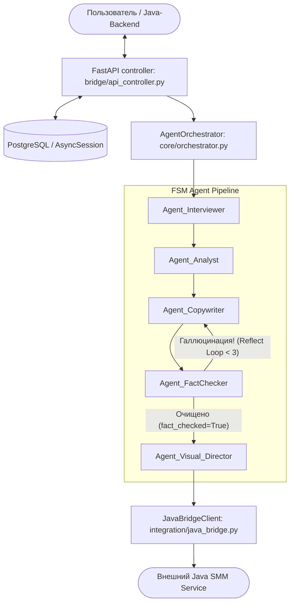
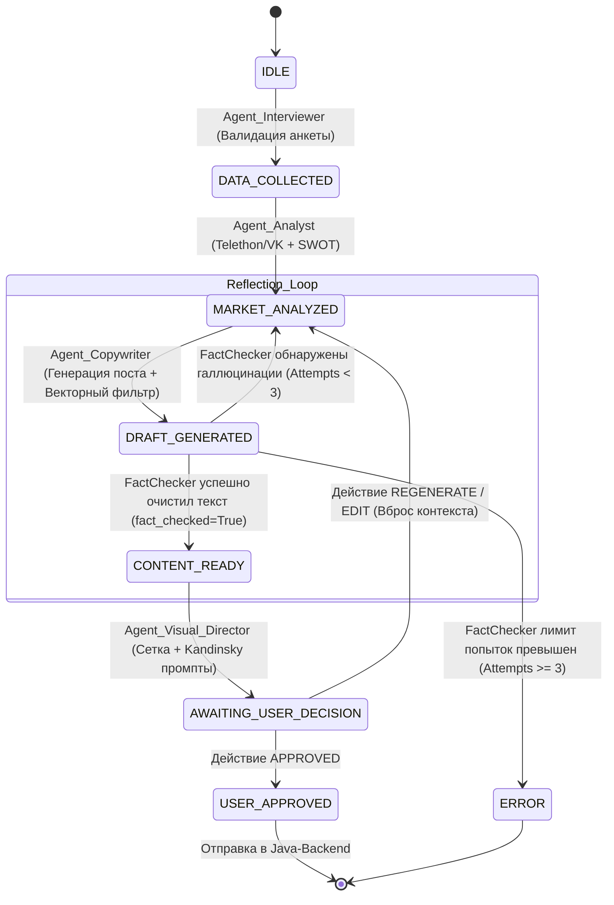
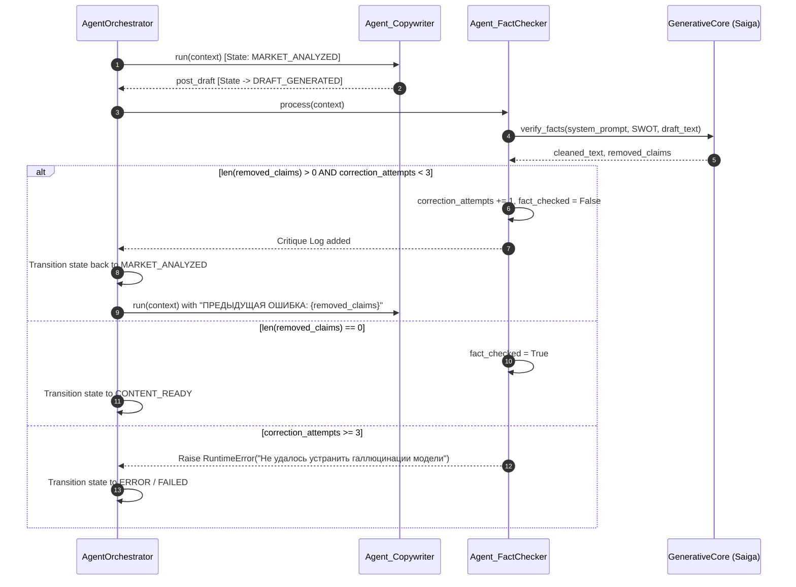

# Архитектурный отчет и техническая спецификация системы «UCust.AI»

**Дата обновления:** 22 июля 2026 г.  
**Версия системы:** 1.2.0-FSM-Reflect  
**Статус:** Выполнен глубокий технический аудит, FSM-интеграция, внедрение агента верификации и цикла рефлексии (Reflection Loop).

---

## 1. Обзор системы

**UCust.AI** представляет собой автономную мультиагентную платформу для автоматизации производственного цикла SMM-контента (маркетинговый анализ, генерация постов, проверка уникальности, фактчекинг галлюцинаций, планирование визуала и дистрибуция). 

Ключевым ядром системы является **Agentic Pipeline** на базе локальных нейросетевых моделей (LLM Saiga / GenerativeCore), управляемый конечным автоматом (**FSM**) под контролем модуля `AgentOrchestrator`. Архитектура обеспечивает детерминированные переходы между этапами, полную изоляцию агентов, асинхронность в обработке задач и встроенный цикл рефлексии (Self-Correction Loop) для подавления галлюцинаций языковой модели.

---

## 2. Жизненный цикл (FSM)

Управление цепочкой выполнения задач осуществляется конечно-состоятельным автоматом (Finite State Machine). Оркестратор гарантирует соблюдение строгого порядка состояний и корректную реакцию на внешние события и ошибки.

### Строгая цепочка состояний FSM:
$$\text{IDLE} \longrightarrow \text{DATA\_COLLECTED} \longrightarrow \text{MARKET\_ANALYZED} \longrightarrow \text{DRAFT\_GENERATED} \longrightarrow \text{CONTENT\_READY} \longrightarrow \text{AWAITING\_USER\_DECISION} \longrightarrow \text{USER\_APPROVED}$$

---

## 3. Агенты конвейера

Система состоит из 5 специализированных агентов, каждый из которых имеет жестко заданные прекондишны состояний и изолированные зоны ответственности:

### 1. `Agent_Interviewer` (Прекондишн: `IDLE`)
* **Назначение:** Прием и валидация 5-шаговой анкеты пользователя (`UserQuestionnaire`).
* **Функционал:** Сохраняет/обновляет профиль компании в PostgreSQL (`UserProfile`), подготавливает стартовый `AgentContext`.

### 2. `Agent_Analyst` (Прекондишн: `DATA_COLLECTED`)
* **Назначение:** Сбор внешних рыночных сигналов и построение SWOT-матрицы.
* **Функционал:** Агрегирует данные парсинга Telegram (`TelethonCollector`) и VK (`VkApiCollector`), проводит очистку через `PreProcessor` и формирует объективную SWOT-матрицу (`SWOTResultSchema`) и маркетинговую стратегию (`StrategyPlanSchema`).

### 3. `Agent_Copywriter` (Прекондишн: `MARKET_ANALYZED`)
* **Назначение:** Создание текста публикации и семантический контроль уникальности.
* **Функционал:** Генерирует черновик поста. Проверяет дубликаты через векторное хранилище `InMemoryVectorStore` (косинусное сходство с порогом 0.9). Учитывает пользовательские редактирования (события `gratitude`, `holiday`, `achievement` и др.).
* **Рефлексия:** При наличии критики от Фактчекера включает в промпт жесткую инструкцию по исключению выдуманных фактов.

### 4. `Agent_FactChecker` (Прекондишн: `DRAFT_GENERATED`)
* **Назначение:** Автоматический фактчекинг и очистка текста от галлюцинаций LLM Saiga.
* **Функционал:** Сопоставляет утверждаемые в посте факты с исходной SWOT-матрицей и стратегией. Использует строгий системный промпт. Заполняет список `removed_claims` и управляет циклом самокоррекции.

### 5. `Agent_Visual_Director` (Прекондишн: `CONTENT_READY`)
* **Назначение:** Планирование визуальной контентной сетки и промптов.
* **Функционал:** Формирует плиточный план публикаций (`GridPlanSchema`) и генерирует адаптированные технические промпты (`KandinskyPromptSchema`) для последующей передачи в генеративный Java-сервис.

---

## 4. Reflection Loop (Цикл рефлексии)

Для предотвращения недостоверных заявлений, недоказанных метрик и галлюцинаций нейросети Saiga внедрен асинхронный **Self-Correction Loop**.

### Механика работы:
1. **Системный промпт фактчекера:**
   > *"Ты — строгий фактчекер. Тебе даны исходные факты (SWOT, стратегия) и черновик текста. Твоя задача: 1. Найти и удалить любые факты, цифры, имена и утверждения в черновике, которых НЕТ в исходных фактах. 2. Вырезать несуществующие или бессмысленные слова. 3. Вернуть только очищенный текст, не добавляя ничего от себя."*
2. **Анализ расхождений:** `Agent_FactChecker` сравнивает утверждения поста с SWOT и при обнаружении галлюцинаций заполняет массив `removed_claims`.
3. **Откат состояния и инструкция-критика:** Если `len(removed_claims) > 0` и `correction_attempts < 3`, фактчекер инкрементирует `correction_attempts`, проставляет `fact_checked = False` и возвращает FSM в состояние `MARKET_ANALYZED`. При повторном запуске `Agent_Copywriter` видит список ошибок и обогащает промпт:
   $$\text{"ПРЕДЫДУЩАЯ ОШИБКА: Ты выдумал следующие факты: } \{removed\_claims\}. \text{ Исключи их полностью. Опирайся строго на SWOT."}$$
4. **Circuit Breaker (Защита от зацикливания):** При достижении лимита `correction_attempts >= 3` оркестратор прекращает повторные попытки и переводит статус задачи в `FAILED` с сообщением `"Не удалось устранить галлюцинации модели"`.

---

## 5. Инфраструктура и стек

### Технологический стек (Tech Stack)
* **Core & Async Pipeline:** Python 3.10+, FastAPI, Pydantic v2, `asyncio`, `httpx`.
* **ML / LLM Слой:** GenerativeCore (интеграция Saiga 3 / Llama-based), RoSBERTa preprocessor, Kandinsky visual prompt engine.
* **База данных & Кэш:** PostgreSQL 15+ (драйвер `asyncpg`, ORM `SQLAlchemy v2.0` с `AsyncSession` и `async_sessionmaker`), локальный файловый фолбэк SQLite (`sqlite:///./ai_smm_dev.db`).
* **Векторный поиск:** `InMemoryVectorStore` (NumPy Cosine Similarity для семантической дедупликации).
* **Транспорт & Интеграции:** `JavaBridgeClient` (HTTP REST Gateway к внешнему Java-бэкенду).

### База данных и контракты Pydantic
Все ключевые модели данных описаны декларативно с помощью Pydantic v2 (`schemas/models.py`) и ORM-моделей SQLAlchemy v2.0 (`storage/models.py`):

* `UserProfile`: хранение анкетных данных пользователя (шаги 1–5).
* `ContentTask`: отслеживание асинхронных задач генерации (`job_id`, `status`, `result_payload`, `error_message`).
* `PostDraftSchema`: расширен новыми полями:
  * `fact_checked: bool` — статус прохождения верификации фактчекером.
  * `removed_claims: List[str]` — список удаленных галлюцинированных фактов.

### REST API Endpoints (`bridge/api_controller.py`)

1. `POST /api/v1/process`
   * Принимает JSON: `{"user_id": "string"}`.
   * Создает задачу со статусом `PENDING` в PostgreSQL через `await create_task(...)`.
   * Запускает фоновый конвейер через `BackgroundTasks` с отдельной изолированной сессией БД.
   * Возвращает HTTP 202 Accepted: `{"status": "accepted", "job_id": job_id}`.

2. `GET /api/v1/status/{job_id}`
   * Считывает актуальное состояние задачи через `await get_task(job_id, session)`.
   * Возвращает статус (`AWAITING_USER_ACTION`, `COMPLETED`, `FAILED`), сгенерированный текст/визуал и ошибки.

3. `POST /api/v1/action/{job_id}`
   * Подсистема **Human-in-the-Loop**.
   * При действии `APPROVED`: автоматически отправляет черновик и Kandinsky-промпты в Java-бэкенд через `JavaBridgeClient` и обновляет статус задачи в БД на `COMPLETED`.
   * При действиях `EDIT` / `REGENERATE`: вносит пользовательские правки и запускает повторную итерацию FSM.
