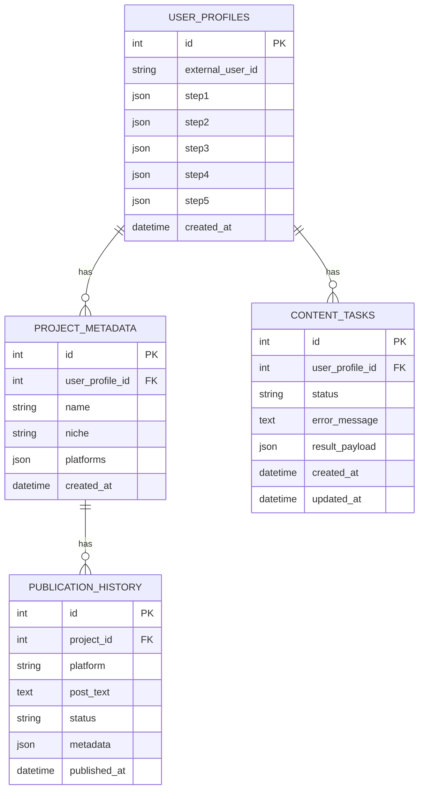
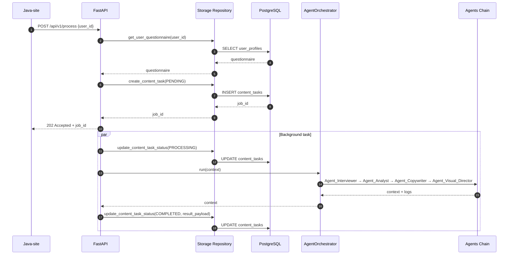
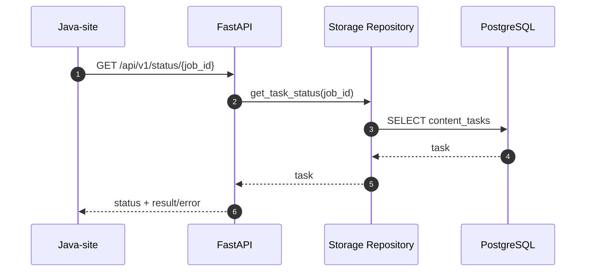
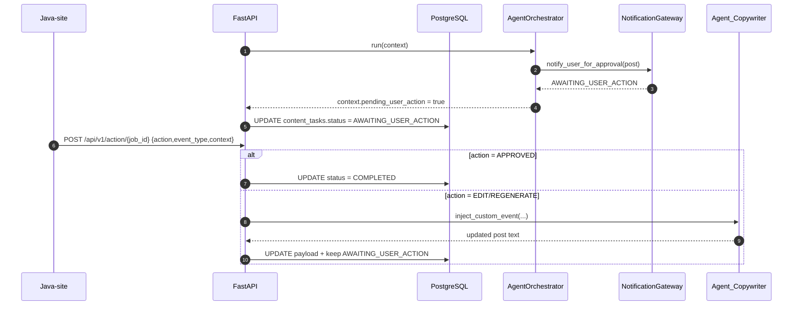

# Архитектура и интеграционный отчет «UCust.AI» (v2.5.0)

**Версия:** 2.5.0-UnifiedGateway  
**Статус:** Production-Ready  
**Порт по умолчанию:** `8000` (в WireGuard туннеле `10.0.0.2:8000`)

---

## 1. Общая схема взаимодействий (v2.5.0)

- **Unified AI Gateway (`api_gateway.py`):** Единая входная точка на FastAPI для внешнего бэкенда (Java Spring Boot, Next.js Frontend или локальные клиенты через WireGuard).
- **Client & Tunnel Tracking:** Автоматическое определение IP клиента (`request.client.host`), поддержка заголовка авторизации `X-Internal-Secret: ucust-secret-key-2026` и динамическая диспетчеризация callback-уведомлений.
- **Оркестратор (`core/orchestrator.py`):** Координирует сквозной пайплайн маркетингового анализа, креативной генерации, визуализации и критики.
- **Команда Агентов (`core/agents.py`):**
  1. `Agent_Interviewer` — сбор и нормализация онбординг-анкеты бренда.
  2. `Agent_Analyst` — живой анализ трендов (Tavily/Travity) и парсинг конкурентов (Telethon/VK).
  3. `Agent_Copywriter` — генерация постов через локальную Saiga LLM (8B) и проверка уникальности по RAG Vector Store.
  4. `Agent_Visual_Director` — генерация графики и видео (ComfyUI / LTX-2.3), мультимодальный VQA-анализ (Moondream).
  5. `Agent_Critic_Munger` — стресс-тестирование гипотез и инверсионный аудит Чарли Мангера.
  6. `ToV_Gatekeeper` & `SecurityGuard` — проверка соблюдения редполитики, цензуры и безопасности.
- **Smart Publishers (`publishers/`):** Омниканальная публикация в Telegram, VK, OK, MAX.

---

## 2. API Спецификация Gateway v2.5.0

Файл: `ai/api_gateway.py`

### 2.1. Главные эндпоинты оркестратора

#### `POST /api/v1/orchestrator/execute` (и алиас `/api/v1/task/execute`)
Сквозной запуск оркестратора для генерации контент-планов, стратегий и постов.
* **Headers:** `X-Internal-Secret: ucust-secret-key-2026`
* **Body:**
  ```json
  {
    "mode": "marketing",
    "user_id": "client_123",
    "prompt": "Сделай анонс сезонной акции",
    "target_platform": "telegram",
    "callback_url": "http://10.0.0.1:8080/api/v1/ai/callback"
  }
  ```
* **Response (200 OK):**
  ```json
  {
    "status": "success",
    "task_id": "task_uuid",
    "user_id": "client_123",
    "result": { ... },
    "logs": [ ... ]
  }
  ```

#### `POST /api/v1/ai/tasks/async-generate`
Постановка задачи в асинхронную очередь с мгновенным возвратом `task_id` (`202 Accepted`).

#### `GET /api/v1/ai/tasks/{task_id}/status`
Проверка текущего статуса и извлечение результата выполнения асинхронной задачи (`PENDING` | `IN_PROGRESS` | `COMPLETED` | `FAILED`).

#### `GET /api/v1/ai/health`
Мониторинг доступности сервиса, версии (`2.5.0`) и готовности пула агентов.

### 2.2. Сервисные и аналитические эндпоинты
* `POST /api/v1/collectors/analyze-brand` — парсинг сайта бренда и извлечение Tone of Voice.
* `POST /api/v1/collectors/analyze-documents` — парсинг PDF/Word документов и брендбуков.
* `POST /api/v1/vision/quick-analyze` — VQA-анализ референсных изображений.
* `POST /api/v1/ai/achievements/post` — генерация постов на основе достижений компании.
* `POST /api/v1/ai/rag/query` & `POST /api/v1/ai/rag/ingest` — RAG база знаний.

---

## 3. Стандарты визуального оформления для Telegram

Реализация: `skills/telegram_rich_formatter.py` и `publishers/telegram.py`

1. **1 Фотография:**
   * Отправка через `sendPhoto` с текстом поста в `caption`.
   * Полное соответствие ширины (100% width matching).
   * Поддержка прикрепления интерактивных Inline и Reply кнопок.
2. **2 и более фотографий:**
   * Отправка через **Единый пост-альбом (`sendMediaGroup`)**.
   * Текст поста целиком помещается в подпись (caption) первой фотографии альбома, обеспечивая идеальное совпадение ширины и целостность восприятия.
3. **Коллажи (2x2):**
   * Формируются **только при явной просьбе пользователя** в промпте/подсказках (через `is_collage_requested`). В стандартном режиме множественные медиа публикуются альбомом.
4. **Динамическое обновление кнопок:**
   * Функция `edit_post_buttons` позволяет обновлять или добавлять кнопки к уже опубликованному посту без его удаления и повторной отправки.
5. **Богатая типографика:**
   * Использование цитат `<blockquote>`, скрытого текста `<tg-spoiler>`, жирного начертания `<b>` и моноширинных блоков `<code>`.

---

## 4. Запуск и управление сервисом

### Быстрый запуск на сервере (с автопоиском venv):
```bash
cd /opt/ucust
bash start_ai_service.sh
```

### Проверка статуса портов на Linux:
```bash
# Проверка слушающего порта 8000:
ss -tulpn | grep 8000

# Тест отклика через туннель:
curl http://10.0.0.2:8000/api/v1/ai/health
```


### 9.1. ER‑диаграмма SQL‑схемы



### 9.2. Последовательность запуска обработки (POST /api/v1/process)



### 9.3. Проверка статуса (GET /api/v1/status/{job_id})



### 9.4. User Intercept + Event Injection


